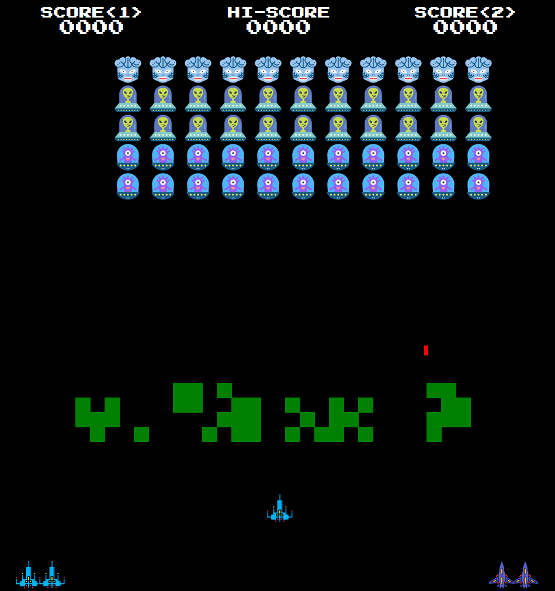

# 👾 Space Invaders (Turtle Edition)

A retro-style **Space Invaders** game developed in **Python** using the **Turtle graphics** library and **pygame** for sound management. The game features alien waves, shields made of destructible blocks, laser shooting, json file for saving higher score, sound effects,and background music.

---

## 📌 Table of Contents

- [👾 Space Invaders (Turtle Edition)](#-space-invaders-turtle-edition)
  - [📌 Table of Contents](#-table-of-contents)
  - [🚀 Features](#-features)
  - [⚙️ How It Works](#️-how-it-works)
  - [🧰 Technologies](#-technologies)
  - [🛠️ Getting Started](#️-getting-started)
    - [1. Clone the repository](#1-clone-the-repository)
    - [2. Run the game](#2-run-the-game)
  - [🎮 Gameplay](#-gameplay)
  - [🎵 Sound and Music](#-sound-and-music)
  - [📚 What I Learned](#-what-i-learned)
  - [📄 License](#-license)
  - [👤 Author](#-author)
  - [💬 Feedback](#-feedback)

---

## 🚀 Features

- Classic Space Invaders gameplay with alien waves and player laser shooting
- Shield system made of blocks that take damage and display visual effects
- Laser collision detection for both player and alien shots
- Sound effects for lasers, explosions, hits, bonuses, and boss events
- Background music with play, pause, resume, and stop controls
- Multiple levels with increasing difficulty
- Visual scoreboard and lives display
- The game keeps the highest score using a json file
- Game state management including pause, resume, and reset



---

## ⚙️ How It Works

- Uses Turtle graphics for rendering game objects and UI
- pygame mixer manages sound effects and background music
- Shields are generated as patterns of blocks with health points
- Collision detection handles lasers hitting shields, aliens, and player
- Player controls a ship to move and shoot lasers upward
- Aliens move and shoot back, with increasing difficulty over levels

---

## 🧰 Technologies

- **Python 3**
- `turtle` for graphics and input handling
- `pygame` for sound and music management
- Custom classes for shields, lasers, player and alien ships

---

## 🛠️ Getting Started

### 1. Clone the repository

```bash
git clone https://github.com/CelmarPA/Space_Invaders_Turtle
cd space_invaders
```

### 2. Run the game

```bash
pip install pygame
python main.py
```

> Make sure the `sounds/` folder contains all required audio files.
> Make sure the `images/alines` folder contains all required gif files.
> Make sure the `images/explosions` folder contains all required gif files.
> Make sure the `images/icons` folder contains all required gif files.
> Make sure the `images/ships` folder contains all required gif files.

---

## 🎮 Gameplay

- Use arrow keys (or A/D) to move the player ship left and right
- Press SPACE to shoot lasers
- Avoid alien lasers and protect your ship using shields
- Destroy all aliens to advance to the next level
- Survive as long as possible and achieve high scores

---

## 🎵 Sound and Music

- SoundManager class handles loading and playing sound effects
- Background music can be paused, resumed, or stopped
- Adjustable volume settings for effects and music

---

## 📚 What I Learned

- Object-oriented programming and game architecture
- Collision detection techniques with Turtle graphics
- Integrating pygame for sound in a Turtle-based game
- Dynamic shield generation and damage feedback
- Game state and event handling in Python

---

## 📄 License

This project is licensed under the **MIT License**.

---

## 👤 Author

**Celmar Pereira de Andrade**

- [GitHub](https://github.com/CelmarPA)
- [LinkedIn](https://linkedin.com/in/celmar-pereira-de-andrade-039830181)
- [Portfolio](https://yourportfolio.com)

---

## 💬 Feedback

Contributions, issues, and suggestions are welcome! Feel free to open an issue or submit a pull request.
